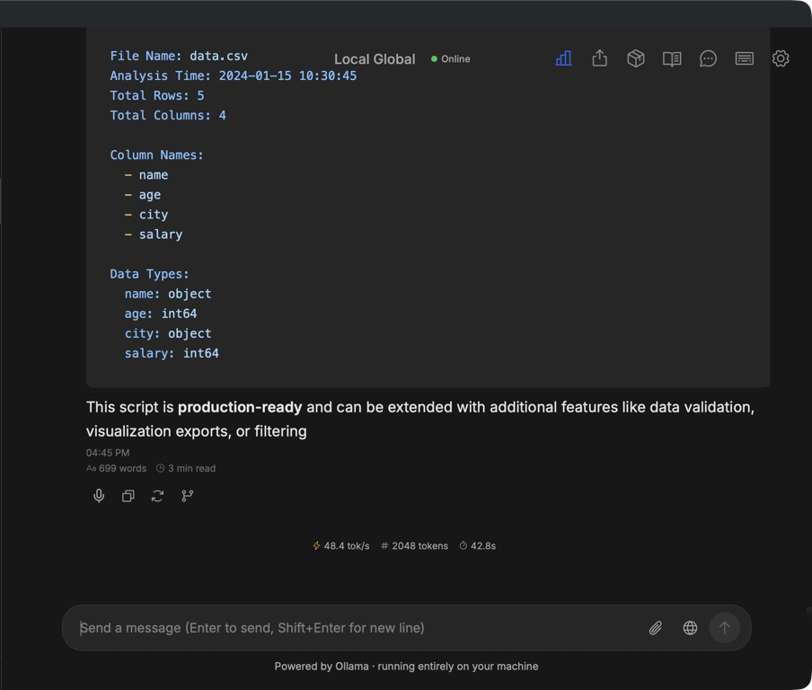

# Local Global

Local Global is a native macOS assistant built around Ollama. Conversations, document retrieval, speech, model management, and tool use run from a local C++ service and an embedded desktop interface.

## Highlights

- Local model chat with streamed reasoning and token statistics
- Durable conversations, branching, tags, templates, and memory
- Local document RAG with citations
- Optional web search and Model Context Protocol tools
- Offline text-to-speech and accessible keyboard workflows
- Native macOS application shell backed by C++17 and Drogon

See [ARCHITECTURE.md](ARCHITECTURE.md) for the implementation map and setup details.

## Local-only files

Model weights, indexed documents, conversation data, generated configuration, MCP endpoints, build products, and virtual environments are intentionally excluded. Create `myapp/mcp_servers.json` locally if you want to configure tools.

